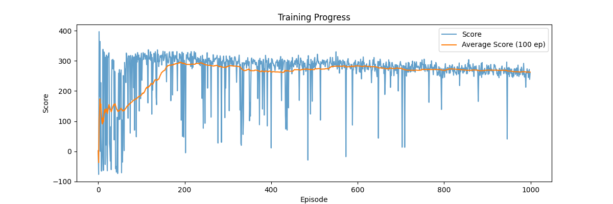
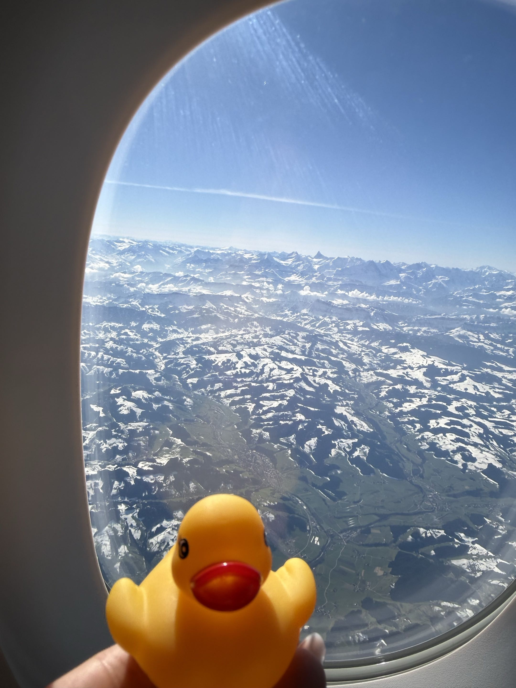
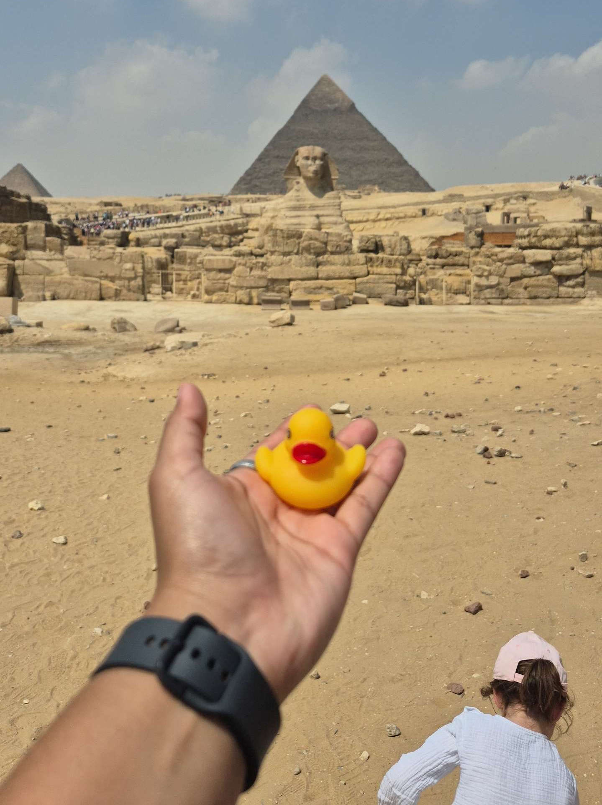
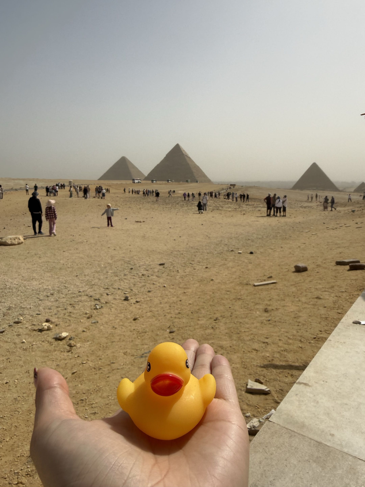
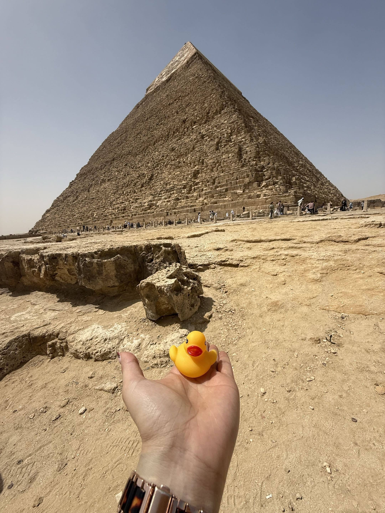
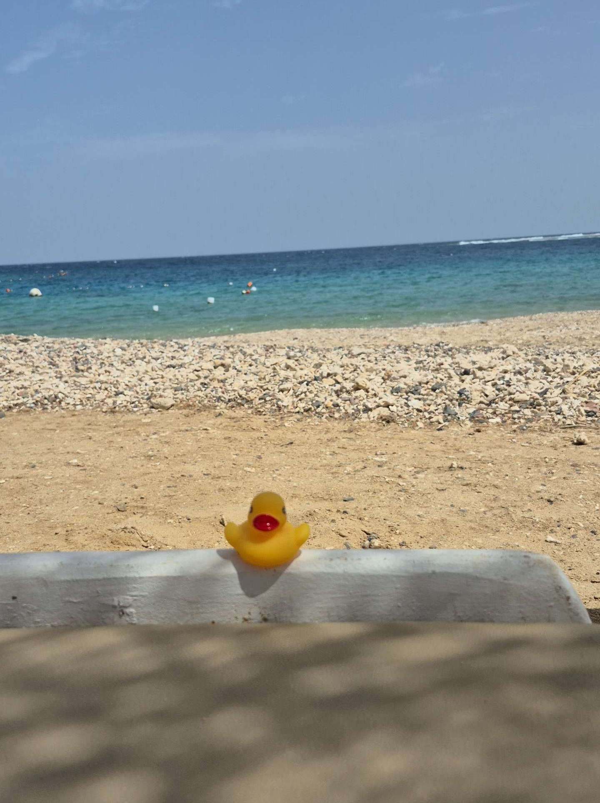

# Lab 3 - Reinforcement Learning for Autonomous Driving

Autrices: Emily Baquerizo & Kimberly Beyeler

Professeure: Marina Zapater

Assistants: Guillaume Chacun & Mehdi Akeddar

Classe: IAA-A

## Introduction
Ce laboratoire a pour objectif d'entraîner un agent de Reinforcement Learning à conduire un Duckiebot de manière autonome dans un réseau routier simulé. L'agent reçoit en entrée une image RGB de la caméra embarquée et doit produire des commandes de vitesse et de direction pour naviguer d'un point de départ à un point d'arrivée en suivant les voies.

## Task 1 
### Implémentation
Le path planning est implémenté dans la méthode `reset()` de `DuckiebotWrapper`. À chaque début d'épisode, un noeud de départ et un noeud d'arrivée sont échantillonnés aléatoirement sur le graphe de la carte. Le chemin entre ces deux noeuds est calculé avec l'algorithme de plus court chemin de NetworkX :
```python
self.path = nx.shortest_path(self.map_graph.G, self.start_node, self.finish_node)
self.next_node = self.path[1]
```
`self.path` contient la liste ordonnée des noeuds à traverser (ex: `["T_2_3", "T_2_4", "T_2_5", ...]`) et `self.next_node` est le premier waypoint après le départ.

### Positionnement initial
Une fois le chemin calculé, le robot est placé sur la case de départ orienté vers `self.next_node`. La direction est déterminée en comparant les coordonnées de la case de départ et du prochain noeud (différence de colonne/ligne), puis convertie en angle selon la convention gym-duckietown. Le robot est positionné dans la bonne voie selon sa direction de marche.

## Task 2 
### Design de la fonction de récompense
La fonction de récompense guide l'agent vers un comportement de conduite autonome en combinant plusieurs composantes :  
**Avancement** : une récompense égale à la vitesse du robot est ajoutée à chaque step. Cela l'encourage à avancer plutôt que de rester immobile.  
**Suivi de voie** : la distance latérale au centre de la voie (`dist`) est soustraite à la récompense. Plus le robot s'éloigne du centre, plus il est pénalisé.  
**Alignement avec la voie** : le produit scalaire entre la direction du robot et la direction de la voie (`dot_dir`) est ajouté avec un poids de 1.2. Cela encourage le robot à rester aligné avec la voie et pénalise les angles trop importants.  
**Fluidité du steering** : les changements brusques de direction entre deux steps consécutifs sont pénalisés avec un poids de 0.5. Cela favorise une conduite fluide.  
**Fin d'épisode** : si l'épisode se termine par une collision ou une sortie de route, une pénalité de -100 est appliquée. Si le goal est atteint, un bonus de +100 est accordé.

## Task 3
### Choix d'algorithme RL
#### Justification
Il existe plusieurs familles d'algorithmes RL :
- Value-based : apprend une fonction de valeur Q(s,a) et en déduit la politique. Limité aux espaces d'actions discrets et est donc incompatible avec nos actions continues (velocity, steering).
- Policy-based : optimise directement la politique. Compatible avec les actions continues mais apprentissage instable à cause de la haute variance.
- Actor-Critic : combine les deux. L'Actor optimise la politique, le Critic estime V(s) pour réduire la variance. C'est la famille la plus adaptée à notre cas car notre espace d'actions est continu et notre observation est une image RGB.
Au sein de la famille Actor-Critic, nous choisissons PPO (Proximal Policy Optimization) pour sa stabilité : son mécanisme de clipping empêche les mises à jour trop grandes de la politique, ce qui est important car les épisodes dans gym-duckietown sont courts et les données collectées sont limités.
#### Hyperparamètres
| Paramètre     | Valeur | Rôle                                                     |
| ------------- | ------ | -------------------------------------------------------- |
| Learning rate | $3 * 10^{-4}$ | Vitesse d'apprentissage de l'optimiseur Adam             |
| Gamma (γ)     | 0.99   | Facteur de discount, importance des récompenses futures |
| GAE lambda    | 0.95   | Lissage des avantages                                    |
| Clip epsilon  | 0.2    | Limite les mises à jour de la politique                  |
| Value coef    | 0.5    | Poids de la loss du Critic                               |
| Epochs        | 4      | Nombre de passes de mise à jour par épisode              |
| Épisodes      | 1000   | Durée totale de l'entraînement                           |
### Architecture du réseau
#### Backbone CNN
L'image, initialement de taille 480×640×3, est redimensionnée à 120×160×3 avant d'être passée au réseau.. Elle passe par trois couches de convolution qui extraient progressivement des features visuelles (bords, couleurs, lignes de route,...). La sortie est aplatie en un vecteur 1D puis transformée en un vecteur de 512 dimensions par une couche fully connected. 
#### Tête Actor
Prend le vecteur de 512 dimensions et prédit une distribution normale sur les deux actions (velocity, steering). L'agent tire une action dans cette distribution afin d'explorer naturellement. Au début, l'écart-type est grand, puisqu'il y a beaucoup d'exploration, puis il diminue au fur et à mesure de l'apprentissage.
#### Tête Critic
Prend le même vecteur de 512 dimensions et prédit une valeur scalaire V(s), une estimation de la récompense future attendue depuis l'état actuel. Cette valeur est utilisée dans  `learn()` pour calculer les avantages.
### Implémentation
L'agent est implémenté dans la classe `PPOAgent` avec cinq méthodes :
- `choose_action` : reçoit l'observation (image RGB), la convertit en tensor PyTorch et la passe dans le réseau. L'actor retourne une distribution normale depuis laquelle on tire une action. La velocity et le steering sont ensuite clippés dans leurs plages valides. 
- `store_transition` : stocke à chaque step les données de la transition (observation, action, récompense, done) ainsi que le log_prob et la valeur V(s) calculés lors du `choose_action` précédent.
- `learn` est appelé après chaque épisode. Il calcule les avantages GAE à partir des récompenses et valeurs stockées, puis effectue 4 passes de mise à jour PPO sur le réseau. Les listes sont vidées à la fin.
- `save` et `load` sauvegardent et rechargent les poids du réseau sur disque.

## Task 4
### **`trainer.py`**
L'agent PPO a été intégré dans la boucle d'entraînement en important `PPOAgent` depuis le module `agent` et en l'instanciant avec `PPOAgent()`. À chaque step, `choose_action(obs)` sélectionne une action et `store_transition(obs, action, reward, done)` stocke la transition. Après chaque épisode, `learn()` effectue la mise à jour des poids. Les checkpoints sont sauvegardés toutes les 500 épisodes et à chaque nouveau meilleur score moyen.

### **`evaluator.py`**
Même import et instanciation de `PPOAgent`. L'agent charge un checkpoint existant via `load()` et utilise `choose_action(obs)` en mode évaluation, sans appel à `learn()`.

### Analyse
Le premier entraînement a été fait avec 1000 épisodes car il a tourné sans GPU et a duré 49h. 

On distingue trois phases distinctes :
- **Phase d'exploration (épisodes 0-50)** : les scores sont très variables, avec de nombreux épisodes négatifs. L'agent explore aléatoirement l'environnement sans politique stable.
- **Phase d'apprentissage (épisodes 50-200)** : la moyenne sur 100 épisodes monte rapidement de ~100 à ~300. L'agent commence à associer les bonnes actions aux bonnes observations.
- **Phase de convergence (épisodes 200-1000)** : la moyenne se stabilise autour de 265-280 et ne progresse plus significativement. Le meilleur score moyen de 295 a été atteint à l'épisode 191.

#### Évaluation
L'évaluation sur 10 épisodes donne une récompense moyenne de **306**, ce qui est cohérent avec la convergence observée pendant l'entraînement. Lors de l'observation visuelle du comportement, on constate que l'agent a tendance à tourner sur place plutôt qu'à progresser vers le goal. Cela suggère que l'agent a convergé vers une **politique de survie**, il évite les crashes et reste sur la route mais ne navigue pas efficacement.

#### Ce qui a fonctionné
La reward function basée sur l'alignement avec la voie (`dot_dir`) et la distance au centre (`dist`) a bien guidé l'agent vers un comportement de suivi de voie. Les scores majoritairement positifs à partir de l'épisode 50 montrent que l'agent a appris à rester sur la route.

#### Limites et améliorations possibles
L'agent stagne après l'épisode 200, ce qui suggère une convergence vers un optimum local. Plusieurs améliorations seraient envisageables :
- **Plus d'épisodes** avec accès GPU pour permettre une exploration plus longue
- **Ajustement de la reward function** : ajouter un bonus explicite pour chaque noeud du chemin atteint encouragerait la progression vers le goal. En l'état, l'agent peut obtenir un bon score en restant sur la route sans avancer, ce qui explique le comportement de rotation sur place observé lors de l'évaluation.
- **Ajustement des hyperparamètres** : réduire le learning rate après convergence ou augmenter le coefficient d'entropie pour encourager plus d'exploration
- **Pénaliser l'immobilité** : ajouter une pénalité si la vitesse est trop faible forcerait l'agent à avancer plutôt que de rester sur place

## Conclusion
Ce laboratoire nous a permis d'implémenter et d'entraîner un agent PPO pour la conduite autonome d'un Duckiebot dans un environnement simulé. L'agent a appris à rester sur la route et à éviter les collisions, atteignant une récompense moyenne de 306 lors de l'évaluation.

Cependant, plusieurs limitations ont été rencontrées. L'entraînement sans GPU a duré 49 heures pour 1000 épisodes, ce qui a fortement limité notre capacité à itérer sur les hyperparamètres et la reward function. De plus, des problèmes rencontrés avec la nouvelle VM ont empêché de tester les améliorations identifiées dans l'analyse, notamment l'ajout d'un bonus de progression vers le goal et la pénalisation de l'immobilité, qui auraient pu corriger le comportement de rotation sur place observé lors de l'évaluation.

Pour la suite, un accès GPU permettrait d'entraîner sur davantage d'épisodes et d'explorer plus facilement différentes configurations, ce qui serait nécessaire pour obtenir un agent capable de naviguer efficacement jusqu'au goal.

## Canards
Pour remonter un peu le moral pendant la correction de notre labo qui n'est pas fonctionnel, voici des images de canards duckiebot en voyage en Egypte. 
<div align="center">
  
  
</div> 

<div align="center">
  
  
</div>

<div align="center">
  
  
</div>
